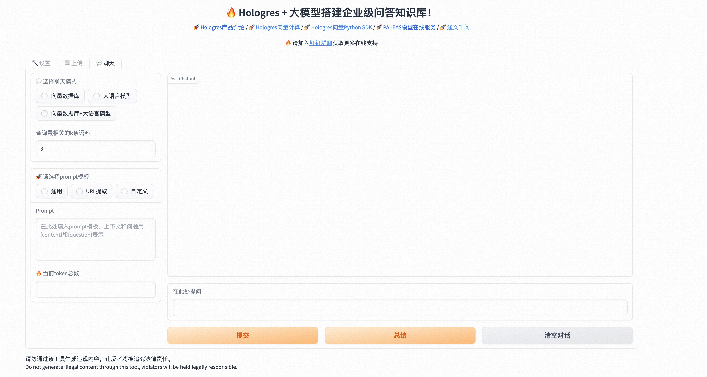

# Hologres 结合 PAI-EAS 部署向量搜索+大模型定制企业级问答机器人


参考文档：[基于计算巢5分钟部署Hologres+PAI+大模型对话知识库](https://help.aliyun.com/zh/hologres/use-cases/deployment-of-enterprise-level-q-a-knowledge-base-based-on-compute-nest-with-a-few-clicks)

- 前提：将大模型部署在PAI-EAS上
- 上传用户本地知识库文件，进行切分并基于embedding模型生成向量
- 将embedding存储到向量数据库，并用于后续向量检索
- 输入用户问题，根据问题用向量检索到最相关的知识条目，结合prompt，用于后续大模型部分生成答案
- 将产生的prompt送入EAS部署的LLM模型服务，实时获取到问题的答案
- 支持接入任意langchain支持的大模型（PAI-EAS部署、本地、API调用）

## Step 1: 开发环境

### 本地安装
以ubuntu 22.04为例，根据操作系统不同，过程中可能有各种走不通的情况，请自行探索，报错缺什么就装什么

```bash
# 安装 anaconda 并创建 python venv
wget https://repo.anaconda.com/archive/Anaconda3-2023.09-0-Linux-x86_64.sh
sh Anaconda3-2023.09-0-Linux-x86_64.sh

conda create --name llm_py310 python=3.10
conda activate llm_py310
```

```bash
git clone https://github.com/aliyun/alibabacloud-hologres-connectors.git
cd holo-chatbot-webui

pip install -r requirements.txt
```

```bash
# 下载Embedding模型
wget https://eas-data.oss-cn-shanghai.aliyuncs.com/3rdparty/chatglm-webui/nltk_data.tar.gz
tar -xvf nltk_data.tar.gz

mkdir embedding_model && cd embedding_model
wget https://easyrec.oss-cn-beijing.aliyuncs.com/qa-test/text2vec-base-chinese.tar.gz
tar -xvf text2vec-base-chinese.tar.gz
cd /
sudo mkdir -p code
cd code
sudo ln -s ~/embedding_model embedding_model
```

## Step 2: 运行启动WebUI
在下面脚本中填入对应的账号信息即可

- EAS_URL: EAS服务URL，可在EAS控制台找到
- EAS_TOKEN: EAS token，可在EAS控制台找到
- HOLO_HOST, HOLO_PORT: Hologres endpoint，可以在Hologres控制台找到
- HOLO_DATABASE: Hologres database名，需要去holoweb手动创建一个db

```bash
conda activate llm_py310
cd holo-chatbot-webui
export EAS_URL="http://xxxxxx.pai-eas.aliyuncs.com/api/predict/xxxxx"
export EAS_TOKEN="xxx=="
export HOLO_HOST="xxx-cn-hangzhou.hologres.aliyuncs.com"
export HOLO_PORT="80"
export HOLO_DATABASE="chatbot"
uvicorn webui:app --host 0.0.0.0 --port 8000
```

访问 http://localhost:8000 看到如下界面即表示启动成功

